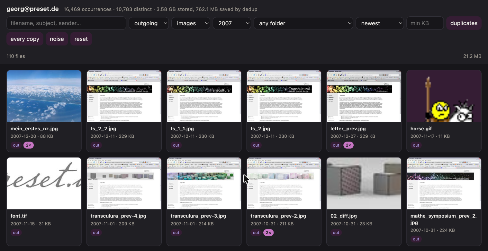

# attic

Make twenty years of mail attachments browsable.

`attic` walks a Maildir tree, pulls out every attachment, stores each
distinct file exactly once, and gives you a local web browser over the lot —
filterable by direction, type, year, folder and size, with duplicates
collapsed and the original message one click away.

Two commands, one dependency, nothing to keep running.

```bash
uv tool install git+https://github.com/rdg/attic

attic extract ~/Mail/example.com --out ~/archive-attachments --me @example.com
attic serve ~/archive-attachments --label me@example.com
```



*Everything sent out in 2007 that was an image. The badges count how many
messages carried the same file.*

## Why

A long-lived mailbox is the most complete archive most people have of their
own working life, and the least navigable. Mine goes back to 2002. Somewhere
in it are every invoice I sent, every logo I was mailed, every contract,
every photo a relative attached and never uploaded anywhere else. Mail
clients are built to answer *"what came in today?"* — they are not built to
answer *"what do I actually have?"*

That second question is the one that matters when a mail server is being
retired, when a business is being wound up, or when you simply want the
photographs out before a provider decides twenty-year-old mail is no longer
their problem. Search does not help: you cannot grep for a file whose name
you have forgotten, attached to a message whose subject you never read.

So `attic` inverts the archive. Instead of messages that happen to carry
files, it gives you **files, with the messages attached to them.** You
browse contact sheets by year. Most of what surfaces is junk — signature
logos, tracking pixels, mail-provider banners. The point is that it surfaces
*as* junk, in bulk, so the twelve things you actually wanted are visible
between them.

Some things become obvious only at this scale:

- **Attachments are mostly duplicates.** In the archive this was built
  against, 16,469 attachment occurrences were 10,783 distinct files. The
  single most-repeated file was a 118-byte transparent GIF appearing **404
  times** across seven years, under a dozen different names.
- **What a file claims to be is often wrong.** Illustrator files declare
  themselves PostScript. Photos arrive as `application/octet-stream`. If you
  trust the headers you will fail to preview a large minority of the archive.
- **Old mail is not UTF-8.** In a mostly-German archive, ninety text
  attachments needed cp1252 or latin-1. Decode them as UTF-8 and every
  umlaut becomes a replacement character.

None of that is visible one message at a time.

## What it does

**`attic extract`** reads every message under `cur/` and `new/`, walks each
MIME tree, and writes three tables plus a content-addressed blob store.

- Each distinct byte sequence is stored once at `blobs/ab/abcdef…`, named by
  its SHA-256. A logo in four thousand signatures costs you one copy.
- Declared filenames go in the database and are **never used as a path on
  disk.** Decades of mail contain filenames with slashes, NULs, RFC 2231
  wreckage, and — from the classic Mac era, where `:` was the path
  separator — colons.
- Types are **sniffed from magic bytes**, with the declared type kept
  alongside for comparison.
- Nothing is discarded. Broken base64 is stored raw and flagged, unparseable
  messages get a row recording the error, and dates fall back from the
  `Date:` header to the maildir filename's epoch prefix to the folder year,
  with `date_source` recording which was used.
- The run is **resumable and idempotent.** A message whose path, mtime and
  size already match a row is skipped, so a re-run after a fresh sync reads
  only new mail. Interrupting it is safe.

**`attic serve`** is a local browser over that index. It binds to localhost
and has no authentication, because it serves private mail.

- One card per distinct file by default, with a badge for how many messages
  carried it. `every copy` switches to one card per occurrence.
- Filter by direction, type, year, folder and minimum size; sort by date,
  size, name or copy count.
- Thumbnails are generated on demand and cached, taking a page of grid from
  megabytes to kilobytes.
- **Open the message** an attachment arrived on: headers, siblings, and the
  body as plain text.
- `--label` names the mailbox in the header and tab title and derives the
  accent colour from it, so two mailboxes open at once cannot be confused.

## Previewing

| sniffed type | preview |
|---|---|
| `application/pdf` | inline, in the browser's own viewer |
| png, jpeg, gif, webp, bmp, ico | the original |
| any other `image/*` | a converted copy — TIFF is the main case |
| `text/*`, xml, csv, json, ics | the decoded text |
| everything else | download it |

TIFF matters more than its share suggests: browsers cannot decode it at all,
so without conversion those files are invisible rather than merely ugly.

### Coverage

Measured over a real archive of **119,829 messages** holding 29,595 distinct
files:

| | |
|---|---|
| identified by magic bytes | **97.6%** |
| previewable without leaving the browser | **89.8%** |

The 2.4% the sniffer cannot name are mostly Apple resource forks, TNEF
(`winmail.dat`), PKCS#7 signatures and dead formats like Shockwave. They are
still extracted, hashed and downloadable — an unrecognised file is listed
with its declared type, never dropped.

What that archive actually contained, by share of distinct files:

| share | type |
|---|---|
| 27.8% | JPEG |
| 20.6% | plain text |
| 16.6% | HTML |
| 15.5% | PDF |
| 6.3% | PNG |
| 2.6% | GIF |
| 2.6% | legacy Office (`.doc`, `.xls`) |
| 2.4% | unidentified |
| 1.8% | ZIP |

## Privacy

This tool reads private mail and writes it, decoded, to disk. A few
decisions follow from that and are not configurable:

- **Nothing in a message is ever rendered as markup.** Bodies and HTML
  attachments are stripped to text and inserted as text. Blob responses
  carry `default-src 'none'; sandbox`. Opening a 2009 newsletter will not
  load a remote image or tell anyone you read it.
- **The server binds to 127.0.0.1** and has no auth. Do not put it on an
  interface.
- **`--out` is required and has no default**, so the blob store never lands
  somewhere by accident. Keep it outside any git repo.
- **One mailbox per store.** There is deliberately no way to merge two
  people's mail into one index.

## How it is stored

Three tables, so deduplication is structural rather than a query you re-run:

- **`blobs`** — one row per distinct byte sequence, content-addressed.
- **`attachments`** — one row per *occurrence*: which message, which MIME
  part, what it was called there.
- **`messages`** — one row per message file, keyed on its maildir path.

`v_attachments` joins all three. The database is plain sqlite, so anything
the browser does not answer, you can ask directly:

```bash
# Where the bytes actually are
sqlite3 ~/archive-attachments/index.db \
  "SELECT sniffed_type, count(*) n, sum(size)/1048576 MB
   FROM v_attachments GROUP BY 1 ORDER BY 3 DESC LIMIT 15;"

# What is duplicated most, and what it costs
sqlite3 ~/archive-attachments/index.db \
  "SELECT filename, size, count(*) copies, size*(count(*)-1) wasted
   FROM v_attachments GROUP BY sha256 ORDER BY wasted DESC LIMIT 20;"
```

## Requirements

Python 3.11+, and Pillow for thumbnails and format conversion. Without
Pillow the tool still runs: the grid serves originals and says so at
startup.

## Development

```bash
uv sync
uv run pytest          # 80 tests, ~79% coverage
uv run ruff check
uv run ruff format --check
```

The awkward cases are the ones worth testing, so the suite builds its own
Maildir: filenames containing `../`, broken base64, cp1252 bodies, messages
attached to messages, epoch-0 dates, sent folders named in German. There is
no fixture archive to download and nothing depends on a real mailbox.

## Licence

MIT.
